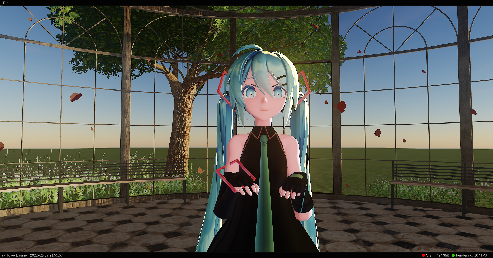
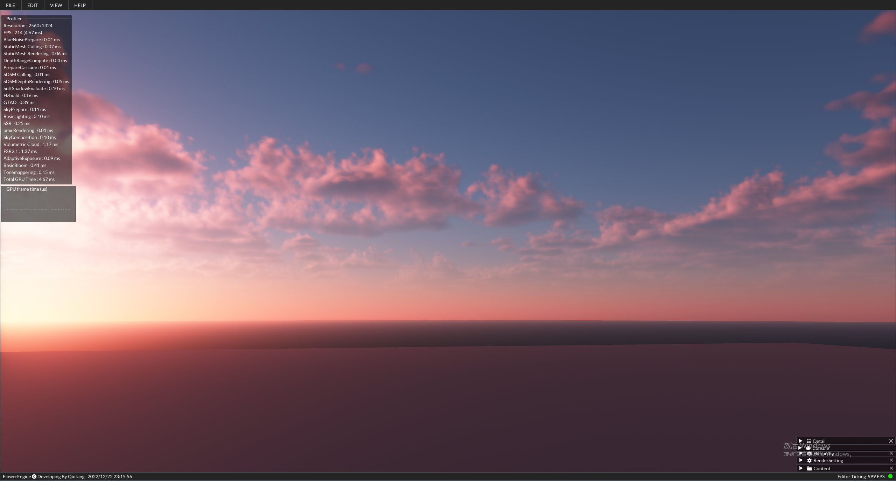

# Flower Engine Ver. 1

​	Flower engine is a vulkan starter friendly render engine.

​	To keep simple, i delete some complex code like animate/serialization etc, and rewrite this version code, to keep engine code clean and easy to understand.

​	There is not too much warping, so every beginner can easy to find out how it work.

​	you can also watch the video on youtube or bilibili:

​	https://www.youtube.com/watch?v=ciw8UOmaFaI

​	https://www.bilibili.com/video/BV1FL4y147DN?share_source=copy_web

## Current Features

1. Gpu dispatch mesh rendering pipeline.
2. Async texture uploading pipeline.
3. Physical-Based rendering and shading.
4. Ground-True approximate ambient occlusion.
5. Stochastic screen space reflection.
6. Precompute atmosphere.
7. Gpu dispatch sample-distribution cascade shadow map.
8. Temporal super sampling.
9. Postprocessing effects.

## How to build

​	Just download the project, all dependency here is ready.(Maybe need install VulkanSDK 1.3 and update driver).

​	Some mesh art asset can download here: https://drive.google.com/file/d/1aRkqTKuqAAmkOSmfe6BSnnycj6HnJaIi/view?usp=sharing

​	and unzip then import mesh. It need some time to cook asset. 

**NOTE: Some RenderSetting like IBL/Atmosphere/Cloud need to change some parameter to get beautiful look.**

**NOTE: When start the application, need to reset FSR accumulation. you can use command cmd.fsr.reset, or just resize render size.**
