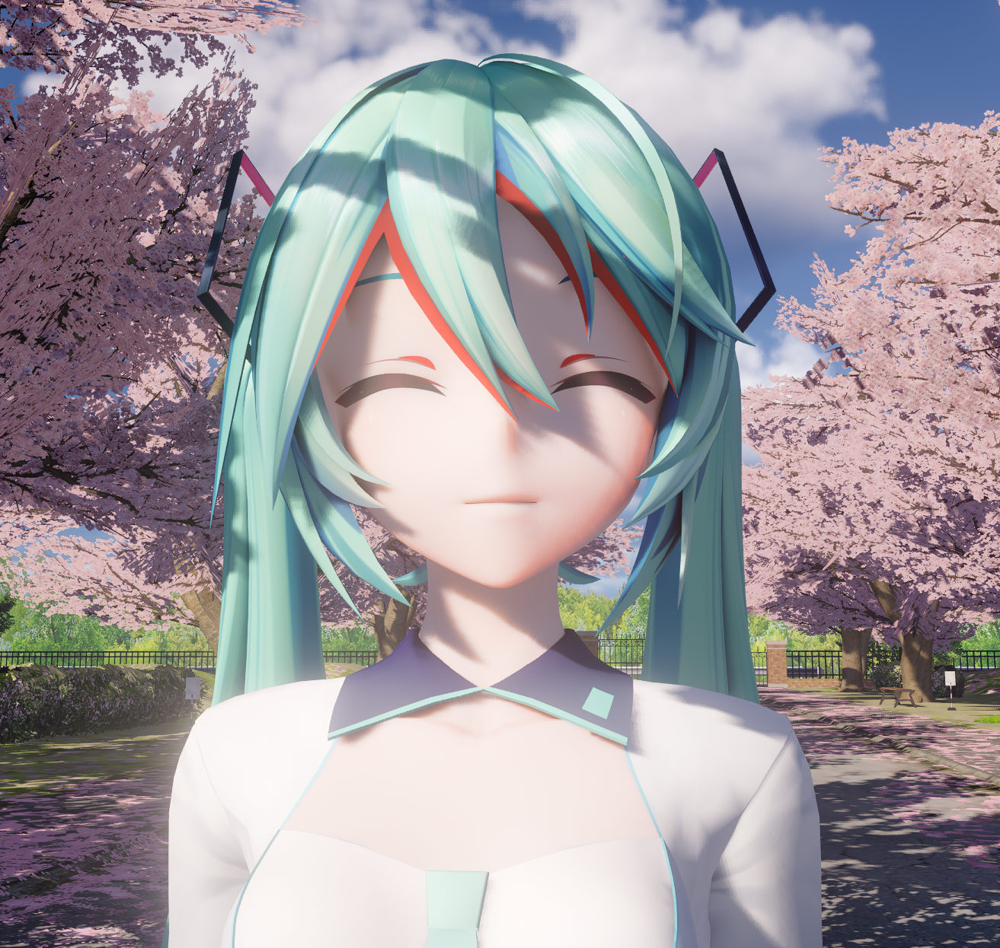
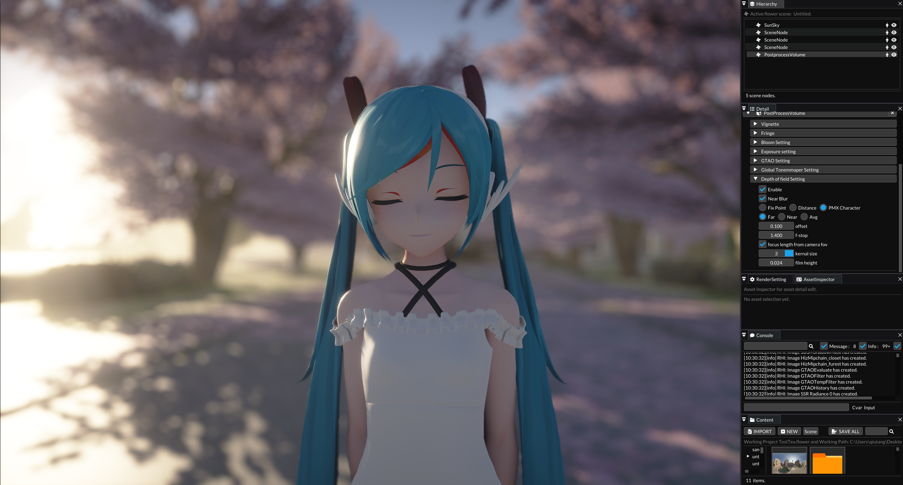
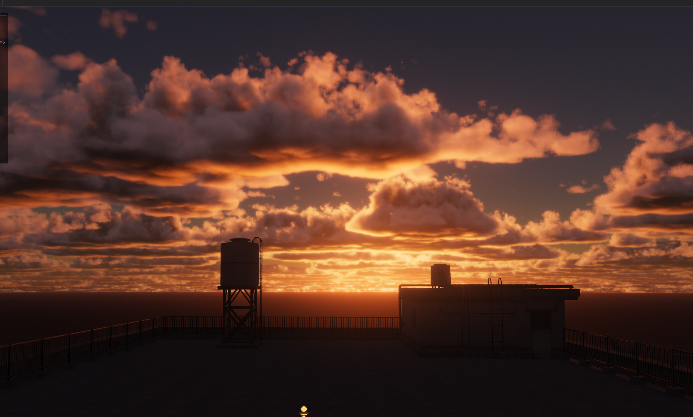
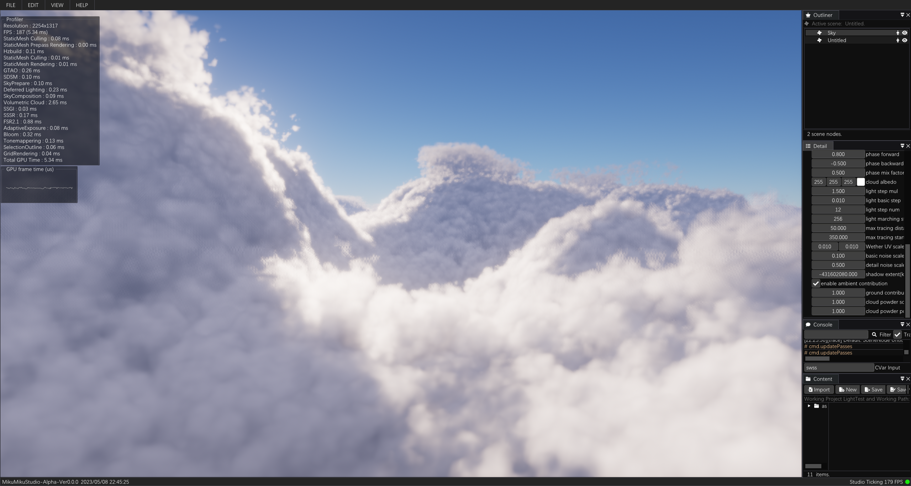
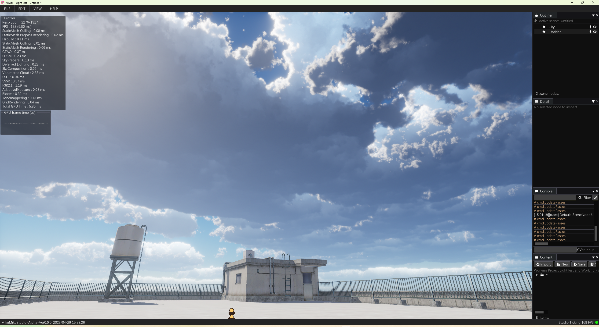

# Miku Fan-Made Free MikuMikuDacne Renderer





**The repo still under positive developing, any community contribution is greeting and welcome.**

​	flower engine is a vulkan starter friendly render engine.

​	There is not too much wrapper, so every beginner can easy to find out how it work.

​	The render passes are some isolated render functions,  pretty easy and **clean** to build a renderer.

## How to build

 Just download the project, all dependency here is ready.(**Maybe need install VulkanSDK 1.3 and update driver**).

There exist three branch, dark branch is clean developing branch. Main branch include MMD features. Release branch is stable legacy branch.


**Dark branch design UI and realtime rendering in 4k, so run in 1k or 2k, maybe need to change configs smaller:**

```
r.ImGui.FontSize
r.ImGui.IconSize
```

**The dark editor support FSR2, use command “r.viewport.screenpercentage” to downscale the render percentage to get better performace.**

 Some mesh art asset can download here:

 https://drive.google.com/file/d/1aRkqTKuqAAmkOSmfe6BSnnycj6HnJaIi/view?usp=sharing

 and unzip then import mesh. It need some time to cook asset.

**When first time open the editor, need something to compile shader variants, and it will cache if next time reopen.**

## Some screenshots and videos

​	you can also watch the video on youtube or bilibili:

​	https://www.youtube.com/watch?v=ciw8UOmaFaI

​	https://www.bilibili.com/video/BV1FL4y147DN?share_source=copy_web









## Current Features

1. Gpu dispatch mesh rendering pipeline.
2. Async texture uploading pipeline.
3. Physical-Based rendering and shading.
4. Ground-True approximate ambient occlusion.
5. Stochastic screen space reflection.
6. Precompute atmosphere.
7. Gpu dispatch sample-distribution cascade shadow map.
8. Temporal super sampling.
9. Postprocessing effects.

## How to build

​	Exist two branch, main branch is developing and may exist some bug, release branch is stable branch.
