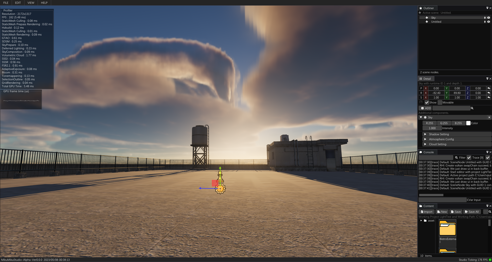
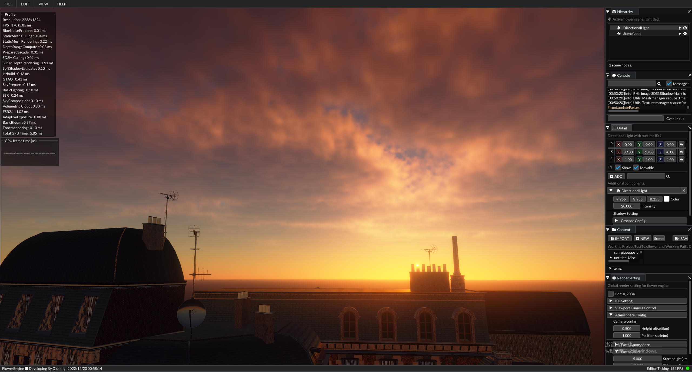

# Miku Fan-Made Free MikuMikuDacne Renderer

**The repo still under positive developing, any community contribution is greeting and welcome.**

​	flower engine is a vulkan starter friendly render engine.

​	There is not too much wrapper, so every beginner can easy to find out how it work.

​	you can also watch the video on youtube or bilibili:

​	https://www.youtube.com/watch?v=ciw8UOmaFaI

​	https://www.bilibili.com/video/BV1FL4y147DN?share_source=copy_web

## Current Features

1. Gpu dispatch mesh rendering pipeline.
2. Async texture uploading pipeline.
3. Physical-Based rendering and shading.
4. Ground-True approximate ambient occlusion.
5. Stochastic screen space reflection.
6. Precompute atmosphere.
7. Gpu dispatch sample-distribution cascade shadow map.
8. Temporal super sampling.
9. Postprocessing effects.

## How to build

​	Exist two branch, main branch is developing and may exist some bug, release branch is stable branch.
